<div align="center">
  

  <h1>PixelForge</h1>

  <p><strong>Open-source media conversion platform for images and videos</strong></p>

  [](LICENSE)
  [](https://www.docker.com/)
  [](https://fastapi.tiangolo.com/)
  [](https://vuejs.org/)
</div>

---

## 🎯 Overview

PixelForge is a  media conversion platform built with modern technologies. It provides a distributed architecture for processing image and video format conversions with real-time status updates and comprehensive monitoring.

### Key Features

- **Multiple Format Support** - Convert between various image and video formats
- **Distributed Processing** - Scalable worker architecture using Celery and Redis
- **Real-time Updates** - WebSocket-based job status notifications
- **Cloud Storage** - MinIO integration for reliable object storage
- **Monitoring & Observability** - Comprehensive metrics and dashboards
- **REST API** - Well-documented API with interactive Swagger UI
- **Modern UI** - Responsive Vue.js frontend with internationalization

---

## 🏗️ Architecture

### Demonstration Video

> [Google Drive](https://drive.google.com/file/d/1a3eUIGdgy31SSKK0oyqx00uIdvRXXKI1/view?usp=sharing)


### mermaid version

```mermaid
sequenceDiagram
    participant User as 👤 User (Vue)
    participant API as 🧩 FastAPI API
    participant DB as 🗄️ PostgreSQL
    participant S3 as ☁️ MinIO
    participant MQ as 🐇 RabbitMQ
    participant Worker as ⚙️ Celery Worker
    participant Redis as 🧠 Redis Pub/Sub

    User->>API: Upload image (POST /job/convert)
    API->>DB: Create Job record (status=PENDING)
    API->>S3: Upload original image
    API->>MQ: Send message (job_id)
    API-->>User: Return Job ID

    Worker->>MQ: Consume job
    Worker->>S3: Download original image
    Worker->>Worker: Convert image
    Worker->>S3: Upload converted image
    Worker->>Redis: Publish status (PROCESSING → SUCCESS)
    Worker->>DB: Update job status in database

    User->>API: Connect WebSocket
    API->>Redis: Subscribe to Pub/Sub channel
    Redis-->>API: Receive status update
    API-->>User: Send real-time status via WebSocket

    User->>API: Request file download
    API->>S3: Stream converted image
    API-->>User: Return StreamingResponse
```



### .png


The platform follows a microservices architecture with three main components:

- **Web Client** - Vue.js SPA for user interactions
- **API Server** - FastAPI backend handling requests and job orchestration
- **Worker Nodes** - Celery workers processing conversion tasks

---

## 🛠️ Technology Stack

### Frontend
| Technology | Purpose |
|------------|---------|
| Vue 3 | Progressive JavaScript framework |
| TypeScript | Type-safe development |
| Vite | Build tool and dev server |
| Pinia | State management |
| Vue Router | Client-side routing |
| Element Plus | UI component library |
| i18n | Internationalization |

### Backend
| Technology | Purpose |
|------------|---------|
| FastAPI | High-performance web framework |
| SQLAlchemy | ORM and database toolkit |
| Alembic | Database migration tool |
| Pydantic | Data validation |
| Uvicorn | ASGI server |
| python-jose | JWT implementation |
| Passlib | Password hashing |
| asyncpg | Async PostgreSQL driver |

### Worker
| Technology | Purpose |
|------------|---------|
| Celery | Distributed task queue |
| Redis | Message broker and cache |
| Pillow | Image processing library |
| Boto3 | AWS SDK for MinIO integration |
| SQLAlchemy | Database ORM |
| psycopg2 | PostgreSQL adapter |

### Infrastructure
| Technology | Purpose |
|------------|---------|
| Docker | Containerization platform |
| Docker Compose | Multi-container orchestration |
| Nginx | Reverse proxy and web server |
| PostgreSQL | Relational database |
| MinIO | S3-compatible object storage |
| Redis | In-memory data store |
| RabbitMQ | Message broker for Celery |

### Monitoring
| Technology | Purpose |
|------------|---------|
| Prometheus | Metrics collection and storage |
| Grafana | Metrics visualization |
| cAdvisor | Container metrics |
| Node Exporter | System metrics |

---

---

## 🚀 Quick Start

### Prerequisites

- [Docker](https://www.docker.com/get-started) and Docker Compose installed
- Git

### Installation

1. **Clone the repository**
   ```bash
   git clone git@github.com:hfidelis/pixelforge.git
   cd pixelforge
   ```

2. **Navigate to infrastructure directory**
   ```bash
   cd infra
   ```

3. **Start all services**
   ```bash
   docker-compose up -d
   ```

4. **Access the application**
   - **Web Client**: http://localhost:5173
   - **API**: http://localhost:8000/api/v1/
   - **API Documentation**: http://localhost:8000/docs

### Default Credentials

```
Email: admin@pixelforge.com
Password: admin
```

---

## ⚙️ Manual Setup

For development or custom deployments, you can set up each component manually.

### Make sure to have the following services running:
- PostgreSQL
- MinIO
- RabbitMQ
- Redis

### 1. API Setup

```bash
# Navigate to API directory
cd api

# Install dependencies
poetry install

# Configure environment
cp .env.example .env
# Edit .env with your configuration

# Run database migrations
alembic upgrade head

# Start the API server
uvicorn main:app --host 0.0.0.0 --port 8000 --reload --ws websockets
```

### 2. Worker Setup

```bash
# Navigate to worker directory
cd worker

# Install dependencies
poetry install

# Configure environment
cp .env.example .env
# Edit .env with your configuration

# Start Celery worker
celery -A main.celery worker --loglevel=info
```

### 3. Client Setup

```bash
# Navigate to client directory
cd client

# Install dependencies
npm install

# Configure environment
echo "VITE_API_BASE_URL=http://localhost:8000/api/v1/" > .env

# Start development server
npm run dev
```

---

## 🔧 Configuration

### Service Endpoints

| Service | Endpoint | Default Port |
|---------|----------|--------------|
| Web Client | http://localhost:5173 | 5173 |
| API | http://localhost:8000/api/v1/ | 8000 |
| PostgreSQL | localhost | 5432 |
| MinIO Console | http://localhost:9000 | 9000 |
| MinIO API | localhost | 9000 |
| RabbitMQ Management | http://localhost:15672 | 15672 |
| RabbitMQ | localhost | 5672 |
| Redis | localhost | 6379 |
| Grafana | http://localhost:3000 | 3000 |

> **Note**: All ports can be customized in the `docker-compose.yml` file.

---

## 📊 Monitoring

Access the Grafana dashboard at http://localhost:3000 to monitor:

- **System Metrics** - CPU, memory, and disk usage
- **Container Metrics** - Docker container performance
- **Application Metrics** - Job processing, API performance, queue statistics

---

## 📄 License

This project is licensed under the MIT License - see the [LICENSE](LICENSE) file for details.

---

<div align="center">
  <p>Made with ❤️ by hfidelis</p>
</div>
